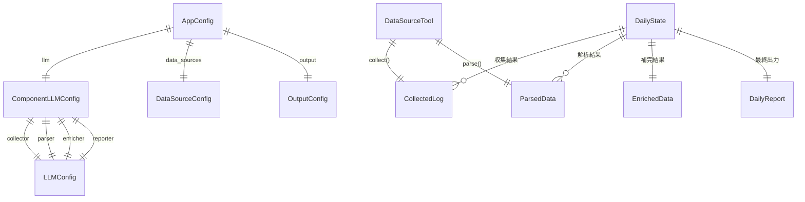
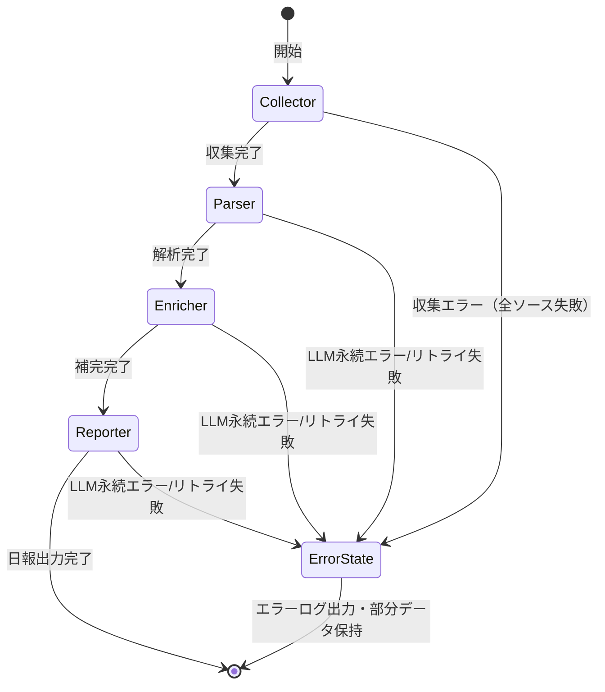

# Data Model: 開発活動ログ自動収集・日報生成フレームワーク

**Date**: 2026-06-20 | **Feature**: 001-auto-daily-report

---

## Entity Overview



---

## 1. 設定エンティティ

### AppConfig（アプリケーション設定）

YAML設定ファイルのルート。全コンポーネントの設定を包含する。

| Field | Type | Required | Description |
|-------|------|----------|-------------|
| `llm` | `ComponentLLMConfig` | ✅ | コンポーネント別LLM設定 |
| `data_sources` | `DataSourceConfig` | ✅ | データソースパス設定 |
| `output` | `OutputConfig` | ✅ | 出力設定 |
| `timeout_seconds` | `int` | ❌ (default: 600) | ログファイル処理タイムアウト（秒） |

**Validation Rules**:
- `output.directory` は存在するディレクトリでなければならない（起動時チェック）
- 全 `LLMConfig` の `model`, `base_url`, `api_key` は必須（未指定時は起動エラー）
- `data_sources` の全パスは絶対パスまたは相対パス（設定ファイル基準）

### ComponentLLMConfig（コンポーネント別LLM設定）

| Field | Type | Required | Description |
|-------|------|----------|-------------|
| `collector` | `LLMConfig` | ✅ | Collectorノード用LLM |
| `parser` | `LLMConfig` | ✅ | Parserノード用LLM |
| `enricher` | `LLMConfig` | ✅ | Enricherノード用LLM |
| `reporter` | `LLMConfig` | ✅ | Reporterノード用LLM |

### LLMConfig（LLM接続設定）

| Field | Type | Required | Description |
|-------|------|----------|-------------|
| `model` | `str` | ✅ | モデル名（例: `Qwen3.6-35B-A3B`） |
| `base_url` | `str` | ✅ | APIベースURL（例: `http://172.21.96.1:8080/v1`） |
| `api_key` | `str` | ✅ | APIキー（llama.cpp の場合は `"not-needed"` 等） |

### DataSourceConfig（データソースパス設定）

| Field | Type | Required | Description |
|-------|------|----------|-------------|
| `copilot_chat_dir` | `str` | ✅ | Copilotチャットログディレクトリ（JSONLファイル格納先） |
| `git_root_dir` | `str` | ✅ | Gitリポジトリ親ディレクトリ（配下を再帰探索） |
| `terminal_history_dir` | `str` | ✅ | ターミナル履歴JSONLファイル格納ディレクトリ |

### OutputConfig（出力設定）

| Field | Type | Required | Description |
|-------|------|----------|-------------|
| `directory` | `str` | ✅ | 日報出力ディレクトリ（絶対パス推奨） |

---

## 2. パイプライン状態エンティティ

### DailyState（LangGraph 共有状態）

パイプライン全ノードで共有される状態オブジェクト。`TypedDict` で定義。

| Field | Type | Initial | Description |
|-------|------|---------|-------------|
| `target_date` | `str` | CLI引数 or 前日 | 日報対象日（`YYYY-MM-DD`） |
| `copilot_chat_raw` | `dict` | `{}` | Copilotチャット収集結果（ファイルリスト） |
| `copilot_chat_parsed` | `list[dict]` | `[]` | Copilotチャット解析結果（圧縮データ） |
| `git_commits_raw` | `dict` | `{}` | Gitコミット収集結果 |
| `git_commits_parsed` | `dict` | `{}` | Gitコミット解析結果 |
| `terminal_logs_raw` | `dict` | `{}` | ターミナル履歴収集結果 |
| `terminal_logs_parsed` | `dict` | `{}` | ターミナル履歴解析結果 |
| `enriched_data` | `dict` | `{}` | Enricherによる補完・クロスリファレンス結果 |
| `daily_report` | `str` | `""` | 最終日報（Markdown） |
| `errors` | `list[dict]` | `[]` | 発生エラーリスト（`{source, stage, error_type, message}`） |
| `progress_log` | `list[str]` | `[]` | 進捗ログ（標準出力用） |

**State Transitions**:



---

## 3. データソースエンティティ

### DataSourceTool（抽象基底）

全ツールの共通インターフェース。

```python
class DataSourceTool(ABC):
    """データソースツールの抽象基底クラス"""
    name: str          # ツール名（copilot_chat, git_commits, terminal_logs）

    @abstractmethod
    def collect(self, target_date: str, config: DataSourceConfig) -> CollectedLog: ...

    @abstractmethod
    def parse(self, raw: CollectedLog, llm: ChatOpenAI) -> ParsedData: ...
```

### CollectedLog（収集ログ）

| Field | Type | Description |
|-------|------|-------------|
| `source` | `str` | データソース名（`copilot_chat` / `git_commits` / `terminal_logs`） |
| `target_date` | `str` | 対象日付（`YYYY-MM-DD`） |
| `files` | `list[FileInfo]` | 収集ファイル情報リスト |
| `error` | `str \| None` | エラーメッセージ（正常時はNone） |
| `collected_at` | `str` | 収集日時（ISO 8601） |

### ParsedData（解析結果）

| Field | Type | Description |
|-------|------|-------------|
| `source` | `str` | データソース名 |
| `summary` | `str` | LLMによる解析サマリー |
| `structured_data` | `dict` | データソース固有の構造化データ |
| `token_count` | `int` | 解析に使用したトークン数（概算） |
| `chunks_processed` | `int` | 分割処理したチャンク数（分割時のみ） |
| `error` | `str \| None` | エラーメッセージ（正常時はNone） |

### EnrichedData（補完結果）

| Field | Type | Description |
|-------|------|-------------|
| `cross_references` | `list[CrossRef]` | クロスリファレンス結果 |
| `gaps` | `list[str]` | 欠落情報の指摘 |
| `completions` | `list[str]` | 補完されたコンテキスト情報 |
| `contradictions` | `list[str]` | データソース間の矛盾点 |

### DailyReport（日報）

| Field | Type | Description |
|-------|------|-------------|
| `date` | `str` | 対象日（`YYYY-MM-DD`） |
| `title` | `str` | タイトル（`デイリー学習レポート - YYYY-MM-DD`） |
| `sections` | `dict` | セクション別内容（概要、使用技術、学習内容、開発活動、問題と解決策） |
| `sources` | `list[str]` | 使用データソース一覧 |
| `generated_at` | `str` | 生成日時（ISO 8601） |
| `raw_markdown` | `str` | 完全なMarkdownテキスト |

---

## 4. エラーエンティティ

### PipelineError（パイプラインエラー）

| Field | Type | Description |
|-------|------|-------------|
| `error_type` | `ErrorType` | `TEMPORARY` / `PERMANENT` |
| `source` | `str` | エラー発生ノード（`collector` / `parser` / `enricher` / `reporter`） |
| `tool` | `str \| None` | エラー発生ツール（データソースエラーの場合） |
| `http_status` | `int \| None` | HTTPステータスコード（LLMエラーの場合） |
| `message` | `str` | エラーメッセージ |
| `retry_count` | `int` | リトライ回数（0ベース） |
| `timestamp` | `str` | エラー発生日時（ISO 8601） |

### ErrorType（エラー種別）

| Value | Trigger | Action |
|-------|---------|--------|
| `TEMPORARY` | HTTP 429, 5xx, ネットワークタイムアウト | 指数バックオフリトライ（最大3回） |
| `PERMANENT` | HTTP 400, 401, 403, 設定検証エラー | 即時パイプライン停止 |

---

## 5. ファイル命名規則

| Entity | Pattern | Example |
|--------|---------|---------|
| 日報ファイル | `daily_report_YYYY-MM-DD.md` | `daily_report_2026-06-19.md` |
| 詳細ログファイル | `pipeline_YYYY-MM-DD_HH-MM-SS.log` | `pipeline_2026-06-20_09-30-00.log` |

---

## 6. 設定ファイル完全例

```yaml
# dev-log-daily 設定ファイル例
llm:
  collector:
    model: Qwen3.6-35B-A3B
    base_url: http://172.21.96.1:8080/v1
    api_key: not-needed
  parser:
    model: Qwen3.6-35B-A3B
    base_url: http://172.21.96.1:8080/v1
    api_key: not-needed
  enricher:
    model: Qwen3.6-35B-A3B
    base_url: http://172.21.96.1:8080/v1
    api_key: not-needed
  reporter:
    model: Qwen3.6-35B-A3B
    base_url: http://172.21.96.1:8080/v1
    api_key: not-needed

data_sources:
  copilot_chat_dir: /home/takumi/.vscode-server/data/User/workspaceStorage/.../GitHub.copilot-chat/transcripts
  git_root_dir: /home/takumi/github
  terminal_history_file: /home/takumi/.bash_history

output:
  directory: /home/takumi/github/DevLogDaily/tmp/dev_log_daily/output

timeout_seconds: 600
```
