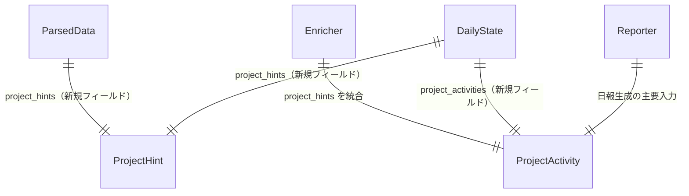
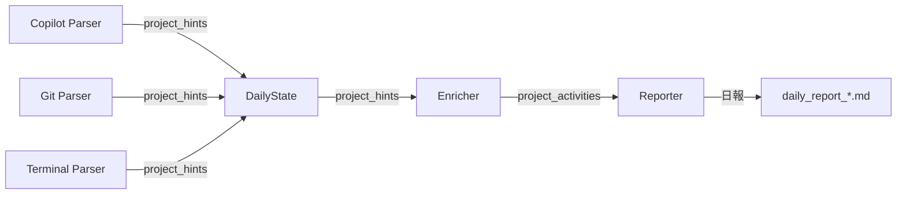
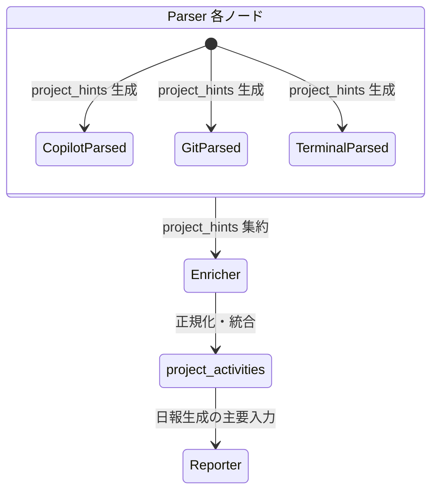
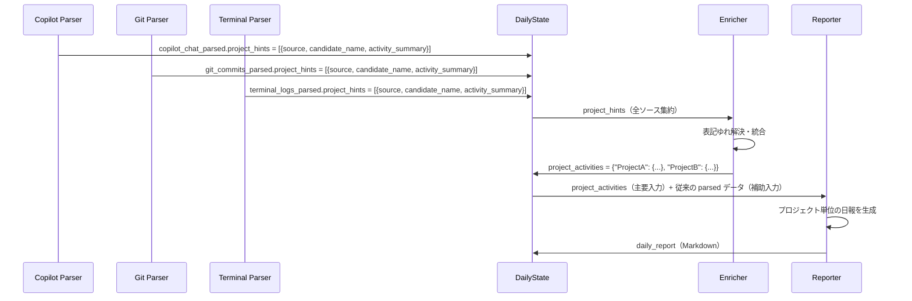

# Data Model: 日報におけるプロジェクトコンテキストの明確化

**Date**: 2026-07-21 | **Feature**: 004-project-context-tracking

---

## Entity Overview



**データフロー**:


---

## 1. 新規エンティティ

### ProjectHint（プロジェクトヒント）

Parser が各データソースから抽出する生のプロジェクト名候補。`ParsedData.project_hints` フィールドとして保持され、Enricher による統合処理の入力となる。

| Field | Type | Required | Description |
|-------|------|----------|-------------|
| `source` | `str` | ✅ | データソース種別（`copilot_chat` / `git_commits` / `terminal_logs`） |
| `candidate_name` | `str` | ✅ | 抽出されたプロジェクト名候補。Copilot チャットはワークスペース名、Git コミットはリポジトリのディレクトリ名、ターミナル履歴は cwd のディレクトリ名（パス末尾） |
| `activity_summary` | `str` | ✅ | 当該プロジェクトでの活動要約（50〜200文字程度） |

**Validation Rules**:
- `candidate_name` は空文字列不可
- `source` は定義済みの3種のいずれか

**各ソースの抽出ロジック**:

| データソース | 抽出元 | candidate_name の例 |
|-------------|--------|-------------------|
| Copilot チャット | `workspace[].workspace_name`（workspace.json から抽出） | `DevLogDaily` |
| Git コミット | `files[].path` リポジトリパスの basename | `dev-log-daily` |
| ターミナル履歴 | `entries[].cwd` のディレクトリ名（パス末尾） | `DevLogDaily` |

---

### ProjectActivity（プロジェクト活動）

Enricher が全ソースの `ProjectHint` を統合して生成する正規化済みプロジェクト情報。

| Field | Type | Required | Description |
|-------|------|----------|-------------|
| `project_name` | `str` | ✅ | プロジェクト名（LLM により正規化され統一された名称） |
| `source_activities` | `dict[str, list[str]]` | ✅ | データソース種別をキーとし、各ソースの活動要約テキストのリストを値とする辞書 |
| `time_range` | `dict` | ❌ | 活動時間範囲（`start`, `end` を ISO 8601 形式で保持）。該当なしの場合は空 dict |
| `related_sources` | `list[str]` | ✅ | 活動が確認されたデータソース種別のリスト（例: `["copilot_chat", "git_commits"]`） |

**Validation Rules**:
- `project_name` は空文字列不可
- `source_activities` のキーは `copilot_chat` / `git_commits` / `terminal_logs` のいずれか
- `related_sources` の要素は `source_activities` のキーと一致する

---

### ProjectActivitiesDict（プロジェクト活動辞書）

```python
ProjectActivitiesDict = dict[str, ProjectActivity]
```

- キー: 正規化されたプロジェクト名（`project_name`）
- 値: `ProjectActivity` オブジェクト
- DailyState の `project_activities` フィールドとして保持
- Enricher が生成し、Reporter が消費する

---

## 2. 既存エンティティの変更

### DailyState（変更）

新規フィールドを2つ追加:

| フィールド | 型 | 初期値 | 生成ノード | Description |
|-----------|-----|--------|-----------|-------------|
| `project_hints` | `list[dict]` | `[]` | Parser | 全 Parser から収集された ProjectHint のリスト。各 hint は `{source, candidate_name, activity_summary}` 形式 |
| `project_activities` | `dict[str, dict]` | `{}` | Enricher | Enricher が正規化したプロジェクト活動辞書。キーはプロジェクト名、値は ProjectActivity の dict 表現 |

**State Transitions（変更部分のみ）**:



---

### ParsedData（変更）

新規フィールドを1つ追加:

| フィールド | 型 | 初期値 | Description |
|-----------|-----|--------|-------------|
| `project_hints` | `list[dict]` | `[]` | 当該 Parser が抽出した ProjectHint のリスト。各要素は `{source, candidate_name, activity_summary}` 形式 |

**to_dict() 出力に project_hints を含める**（既存の辞書キーとの互換性を維持）。

---

## 3. 状態遷移

### データの流れ



### プロジェクト名の正規化フロー

```text
Copilot の workspace_name: "DevLogDaily"
Git の repo_dir:          "dev-log-daily"
Terminal の cwd:          "/home/user/github/DevLogDaily"

  ↓ Enricher（LLM による表記ゆれ解決）

正規化名: "DevLogDaily"（単一プロジェクトとして統合）
```

---

## 4. バリデーションルール

| 対象 | ルール | 違反時の動作 |
|------|--------|-------------|
| `ParsedData.project_hints` | 各要素に必須フィールドが全て存在する | Parser 実装時に単体テストで保証。ランタイムの厳密な検証は行わない（None の場合は Enricher が無視） |
| `DailyState.project_activities` | キー（プロジェクト名）に重複がない | Enricher が統合時に保証する。重複がある場合は Enricher の実装バグとして扱う |
| プロジェクト名の長さ | 100文字以内 | Enricher のプロンプトで制限。超過した場合は truncate する |
| プロジェクト数の上限 | 1日最大20プロジェクト | 20を超えた場合、Enricher が主要プロジェクトのみ詳細を残し、残りは一覧表示に切り替える |
