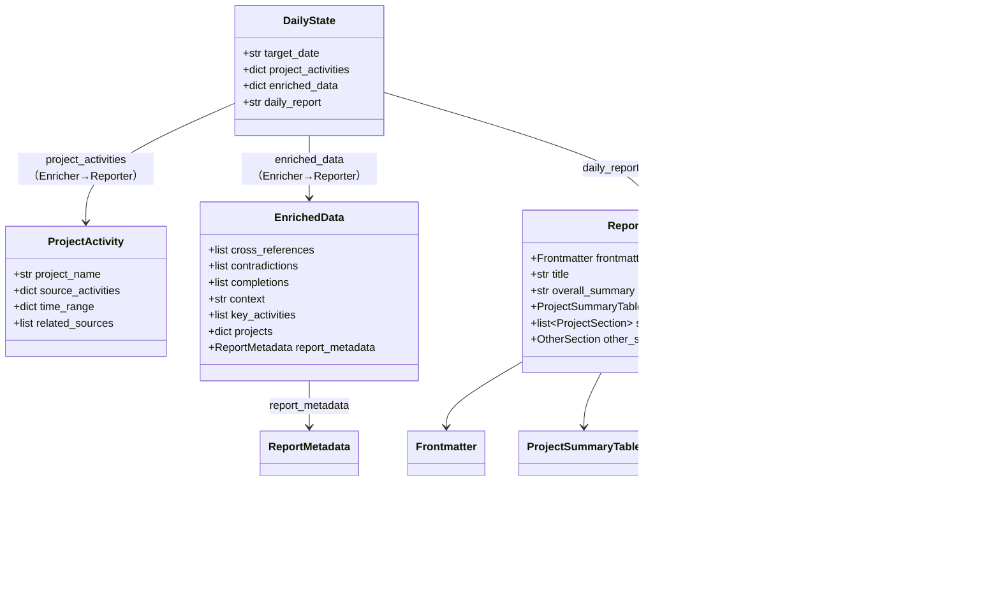

# Data Model: 日報出力フォーマットの大幅リファクタリング

**Phase**: 1 — Spec から抽出したエンティティ定義

**Date**: 2026-07-22

## Overview

本データモデルは Reporter ノードが出力する Markdown 日報の構造と、
Enricher ノードが Reporter に渡す enriched_data の拡張を定義する。
既存の 004 データモデル（ProjectHint, ProjectActivity, DailyState）は変更せず、
本 feature では出力フォーマットに関連するエンティティのみを新規定義する。

---

## Entity: ReportFormat

日報ファイル全体の Markdown 構造。Reporter ノードの出力形式。

| フィールド | 型 | 必須 | 説明 |
|-----------|-----|------|------|
| `frontmatter` | Frontmatter | MUST | YAML フロントマター |
| `title` | str | MUST | "# デイリー学習レポート - YYYY-MM-DD" |
| `overall_summary` | str | MUST | 📋 総合概要（2〜3文） |
| `project_summary_table` | ProjectSummaryTable | MUST | 📊 プロジェクト別活動サマリーテーブル |
| `project_sections` | list[ProjectSection] | MUST | プロジェクトごとの詳細セクション（0〜N個） |
| `other_section` | OtherSection | SHOULD | プロジェクトに紐づかない活動セクション（該当時のみ） |

**制約**:
- frontmatter は常に出力されなければならない（データが空の場合も）
- project_sections が空の場合、全セクションを「該当なし」で埋める
- 見出しレベルは厳守: `#` = タイトル, `##` = プロジェクト名, `####` = サブサブセクション

---

## Entity: Frontmatter

日報ファイル先頭の YAML メタデータ。

| フィールド | 型 | 必須 | デフォルト | 説明 |
|-----------|-----|------|-----------|------|
| `date` | str (YYYY-MM-DD) | MUST | — | 対象日 |
| `tags` | list[str] | MUST | ["DevLogDaily"] | デフォルトタグ＋活動由来タグ（最大10個） |
| `type` | str | MUST | "daily" | 固定値 |
| `mood` | str | MUST | "productive" | データから推定（productive/reflective/frustrated 等） |
| `energy` | int (1-5) | MUST | 4 | データから推定 |
| `aliases` | list[str] | MUST | ["デイリー学習レポート YYYY-MM-DD"] | エイリアス |

**制約**:
- tags はデフォルト（DevLogDaily, LangGraph, Python, SpecKit）＋活動由来タグ
- tags は10個を超えないこと（超過時はLLMが重要度順にフィルタ）
- mood/energy は enriched_data.report_metadata の全体値を使用
- mood/energy が推定できない場合、デフォルト値を使用する（"(推測)" は付けない）

---

## Entity: ProjectSummaryTable

「📊 プロジェクト別活動サマリー」の Markdown テーブル。

| フィールド | 型 | 必須 | 説明 |
|-----------|-----|------|------|
| `rows` | list[SummaryRow] | MUST | テーブルの各行 |

### SummaryRow

| フィールド | 型 | 必須 | 説明 |
|-----------|-----|------|------|
| `project_name` | str | MUST | プロジェクト名（または「その他」） |
| `duration` | str | MUST | 活動継続時間（HH:MM 形式、例: `03:15`） |
| `main_activity` | str | MUST | 主な活動内容（1〜2文） |
| `data_sources` | list[str] | MUST | 関連データソース（Copilot, Git, Terminal） |

---

## Entity: ProjectSection

プロジェクトごとの詳細セクション（見出しレベル `## プロジェクト名`）。

| フィールド | 型 | 必須 | 説明 |
|-----------|-----|------|------|
| `project_name` | str | MUST | プロジェクト名 |
| `overview` | str | MUST | 📋 概要（2〜5文） |
| `technologies` | list[TechItem] | MUST | 🛠 触れた技術・ツール |
| `inputs` | str | SHOULD | 📖 インプット（該当なしの場合は「該当なし」） |
| `learnings` | LearningSection | MUST | 📚 学習内容 |
| `dev_activities` | list[ActivityItem] | MUST | 💻 開発活動 |
| `problems` | list[ProblemItem] | SHOULD | 🚧 発生した問題と解決策（該当時のみ） |
| `retrospective` | RetrospectiveSection | SHOULD | 🔄 振り返り（該当時のみ） |
| `actions` | list[str] | SHOULD | 📌 翌日へのアクション（チェックリスト形式、該当時のみ） |
| `tags` | list[str] | MUST | 🏷 技術タグ |

**制約**:
- データが存在しないサブセクションは「該当なし」と明示するか、セクション自体を省略する
- `dev_activities` の各エントリには種別ラベルが必須

---

## Entity: TechItem

| フィールド | 型 | 必須 | 説明 |
|-----------|-----|------|------|
| `name` | str | MUST | 技術名 |
| `description` | str | MUST | 使用目的と学んだこと |

---

## Entity: LearningSection

| フィールド | 型 | 必須 | 説明 |
|-----------|-----|------|------|
| `new_learnings` | list[LearningItem] | SHOULD | 新しく学んだこと |
| `deepened_understandings` | list[LearningItem] | SHOULD | 理解を深めたこと |

### LearningItem

| フィールド | 型 | 必須 | 説明 |
|-----------|-----|------|------|
| `topic` | str | MUST | 学習トピック |
| `detail` | str | MUST | 学んだ内容とコンテキスト |
| `key_points` | list[str] | SHOULD | 重要なポイントやコード例 |

---

## Entity: ActivityItem

| フィールド | 型 | 必須 | 説明 |
|-----------|-----|------|------|
| `type` | ActivityType | MUST | 活動種別 |
| `description` | str | MUST | 活動内容 |
| `related_files` | list[str] | SHOULD | 関連ファイルパス |
| `commit_hash` | str | SHOULD | 関連コミットハッシュ（Git由来の場合） |

### ActivityType

列挙型: `feat`（機能追加）, `fix`（修正）, `docs`（ドキュメント）, `chore`（その他）

**出力形式**: `` `種別` 内容 — 関連ファイル: パス / コミット: ハッシュ ``

---

## Entity: ProblemItem

| フィールド | 型 | 必須 | 説明 |
|-----------|-----|------|------|
| `summary` | str | MUST | 問題の簡潔な要約 |
| `cause` | str | MUST | 原因 |
| `solution` | str | MUST | 解決方法 |
| `status` | ProblemStatus | MUST | 解決状況 |

### ProblemStatus

列挙型: `解決済`, `未解決`, `一時対処`

**出力形式**: `**問題**: 要約 → **原因**: 原因 → **解決**: 解決方法（`解決済`）`

---

## Entity: RetrospectiveSection

| フィールド | 型 | 必須 | 説明 |
|-----------|-----|------|------|
| `went_well` | list[str] | SHOULD | うまくいったこと |
| `to_improve` | list[str] | SHOULD | 改善したいこと |
| `insights` | list[str] | SHOULD | 明日に活かしたい知見 |

---

## Entity: OtherSection

プロジェクトに紐づかない活動用の簡略セクション。

| フィールド | 型 | 必須 | 説明 |
|-----------|-----|------|------|
| `overview` | str | MUST | 📋 概要 |
| `technologies` | list[TechItem] | SHOULD | 🛠 触れた技術・ツール |
| `learnings` | list[LearningItem] | SHOULD | 📚 学習内容（簡易版） |
| `dev_activities` | list[ActivityItem] | MUST | 💻 開発活動 |
| `problems` | list[ProblemItem] | SHOULD | 🚧 発生した問題と解決策 |
| `tags` | list[str] | MUST | 🏷 技術タグ |

**制約**: 振り返り（🔄）と翌日へのアクション（📌）は除外する。
**「簡易版」の定義**: ProjectSection と比較して以下の点が簡略化される：
- 「新しく学んだこと」のみを含み「理解を深めたこと」は省略する
- 各 LearningItem は `topic` と `detail` のみ必須、`key_points` は省略可
- 箇条書き1〜2行で簡潔に記述する

---

## Entity: ReportMetadata (enriched_data 拡張)

Enricher が Reporter に渡す enriched_data の拡張部分。

| フィールド | 型 | 必須 | デフォルト | 説明 |
|-----------|-----|------|-----------|------|
| `mood` | str | MUST | "productive" | 全体のmood推定値 |
| `energy` | int (1-5) | MUST | 4 | 全体のenergy推定値 |
| `tags` | list[str] | MUST | ["DevLogDaily"] | フロントマター用タグ候補（最大10個） |
| `project_moods` | dict[str, ProjectMood] | SHOULD | {} | プロジェクト別のmood/energy |

### ProjectMood

| フィールド | 型 | 必須 | デフォルト | 説明 |
|-----------|-----|------|-----------|------|
| `mood` | str | MUST | "productive" | プロジェクト単位のmood |
| `energy` | int (1-5) | MUST | 4 | プロジェクト単位のenergy |

**格納場所**: `enriched_data["report_metadata"]` に ReportMetadata オブジェクトとして格納

---

## 既存エンティティとの関係

