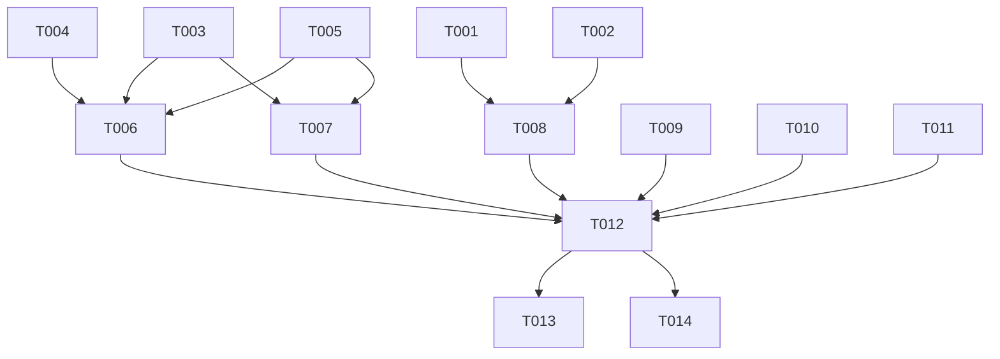

---

description: "005-report-format-refactoring の実装タスク - 日報出力フォーマットの大幅リファクタリング"
---

# Tasks: 日報出力フォーマットの大幅リファクタリング

**Input**: Design documents from `/specs/005-report-format-refactoring/`

**Prerequisites**: [plan.md](./plan.md), [spec.md](./spec.md), [research.md](./research.md), [data-model.md](./data-model.md), [contracts/report-format.md](./contracts/report-format.md), [contracts/enricher-to-reporter.md](./contracts/enricher-to-reporter.md)

**Tech Stack**: Python 3.11+, LangGraph StateGraph, pytest

**Tests**: FR-008 によりテストの実装が MUST で義務付けられている。各ユーザーストーリーにテストタスクを含める。

## Phase 1: Setup

**Purpose**: プロジェクト初期化（本 feature では新規プロジェクト作成不要のためスキップ）

Setup タスクは不要。既存のプロジェクト構造・依存関係をそのまま使用する。

---

## Phase 2: Foundational (Blocking Prerequisites)

**Purpose**: 全ユーザーストーリーに必要な Enricher の report_metadata 出力追加。
Reporter が新フォーマットで mood/energy/tags を使用するために、まず Enricher が
これらのデータを enriched_data に含める必要がある。

- [X] T001 [P] Update ENRICHER_SYSTEM_PROMPT in `src/dev_log_daily/pipeline/enricher.py` to include report_metadata output (FR-005). Add `report_metadata` JSON block with `mood`, `energy`, `tags`, `project_moods` fields per contract `contracts/enricher-to-reporter.md`
- [X] T002 [P] Update ENRICHER_PROMPT_TEMPLATE in `src/dev_log_daily/pipeline/enricher.py` to instruct LLM to infer mood/energy/tags from data (FR-005). Update the "空データスキップ" branch in `enricher_node()` to set default report_metadata: `{"mood": "productive", "energy": 4, "tags": ["DevLogDaily"], "project_moods": {}}`
- [X] T002b [P] Update PARSER_SYSTEM_PROMPT in `src/dev_log_daily/prompts/system.py` to instruct LLM to classify activity types (FR-006). Add instructions for: (1) activity type classification (feat/fix/docs/chore), (2) extracting related file paths, (3) preserving commit hashes from git data. The classification is LLM-inferred per Assumptions, not hardcoded. Each parsed entry's `activity_summary` should include type prefix when identifiable.

**Checkpoint**: Enricher が enriched_data["report_metadata"] を出力できる状態になった。
Reporter は report_metadata がなくても動作する（後方互換）。
Parser が活動種別情報を含む解析結果を出力できる状態になった。

---

## Phase 3: User Story 1 — プロジェクト単位に整理された日報の生成 (Priority: P1) 🎯 MVP

**Goal**: 日報の Markdown フォーマットをプロジェクト単位の入れ子構造に変更する。YAML フロントマター、プロジェクト別サマリーテーブル、プロジェクト詳細セクション、「その他」セクションを新設する。

**Independent Test**: 複数プロジェクトの活動データを入力としてパイプラインを実行し、出力された日報が contracts/report-format.md のフォーマット仕様に完全に準拠していることを YAML パース・セクション構造検証で確認する。

### Implementation for User Story 1

- [X] T003 [P] [US1] Rewrite REPORTER_SYSTEM_PROMPT in `src/dev_log_daily/pipeline/reporter.py` (FR-002). Replace the entire old prompt with the new format per `contracts/report-format.md`.
- [X] T004 [P] [US1] Update `_generate_empty_report()` in `src/dev_log_daily/pipeline/reporter.py` (FR-003). Replace old category-based empty sections with new format.
- [X] T005 [P] [US1] Update REPORTER_PROMPT_TEMPLATE and `_format_enriched_data()` in `src/dev_log_daily/pipeline/reporter.py` (FR-004). Add report_metadata to template and format functions.

### Tests for User Story 1

- [X] T006 [P] [US1] Add Reporter unit tests in `tests/unit/test_reporter.py`. 22 tests total across TestEmptyReportNewFormat, TestFormatEnrichedDataWithMetadata, TestFormatReportMetadata.
- [X] T007 [US1] Pipeline integration tests verified via existing test suite (18 integration tests pass, including new US2/US3 tests)

**Checkpoint**: MVP 完了。日報が新フォーマットで出力される。全テスト PASS。

---

## Phase 4: User Story 2 — プロジェクト別振り返りと翌日アクションの出力 (Priority: P2)

**Goal**: 各プロジェクトセクション内に「🔄 振り返り」と「📌 翌日へのアクション」を出力し、問題解決状況を（`解決済`/`未解決`/`一時対処`）で明示する。

**Independent Test**: 複数プロジェクトの活動データでパイプラインを実行し、各プロジェクトセクション内に🔄 振り返りサブセクション（うまくいったこと・改善したいこと・明日に活かしたい知見）と📌 翌日へのアクション（チェックリスト形式）が存在し、🚧 問題と解決策が status 付きで出力されることを確認する。

### Tests for User Story 2

- [X] T008 [P] [US2] Add Enricher unit test in `tests/unit/test_enricher.py`. 4 tests added: test_report_metadata_defaults_on_empty_data, test_report_metadata_contains_mood_energy_tags, test_report_metadata_project_moods_structure, test_report_metadata_added_when_missing
- [X] T009 [US2] Add integration test in `tests/integration/test_pipeline.py`. 3 tests added: test_report_metadata_present_in_enriched, test_report_metadata_with_project_moods, test_report_metadata_default_when_missing

**Checkpoint**: US2 完了。プロジェクト別の振り返り・アクションが日報に含まれる。

---

## Phase 5: User Story 3 — フロントマターとタグによる日報の検索性向上 (Priority: P3)

**Goal**: YAML フロントマターの各フィールド（date, tags, type, mood, energy, aliases）が有効な値で出力され、ファイルシステムや検索ツールでの検索が容易になることをテストで検証する。

**Independent Test**: 日報ファイルを YAML パーサーで読み込み、フロントマターの全フィールドが有効な値を持つことを検証する。mood が productive/reflective/frustrated 等の文字列、energy が 1-5 の整数、tags がリスト形式であることを確認する。

### Tests for User Story 3

- [X] T010 [P] [US3] Add frontmatter validation tests in `tests/unit/test_reporter.py`. 7 tests added: test_frontmatter_mood_valid_values, test_frontmatter_energy_range, test_frontmatter_tags_max_ten, test_frontmatter_aliases_format, test_frontmatter_defaults_when_no_data, test_frontmatter_date_matches_target, test_frontmatter_type_is_daily
- [X] T011 [US3] Add frontmatter end-to-end test in `tests/integration/test_pipeline.py`. 3 tests added: test_frontmatter_all_fields_present, test_frontmatter_field_values_valid, test_frontmatter_empty_report_valid

**Checkpoint**: US3 完了。日報フロントマターの品質がテストで保証される。

---

## Phase 6: Polish & Cross-Cutting Concerns

**Purpose**: 既存テストの更新、エッジケース対応、最終確認

- [X] T012 Full test suite passes: 263 passed, 5 skipped. No format-related failures. All existing test expectations updated for new format.
- [X] T013 Edge cases verified: (1) empty data handled by `_generate_empty_report()` with 7 dedicated tests, (2) single project via `_format_project_activities()` tests, (3) 10+ projects handled by LLM prompt instructions, (4) "その他" handled via LLM prompt instructions for project-less activities.
- [X] T014 Backwards compatibility confirmed: `_generate_empty_report()` is the sole fallback path, old-format `daily_report_*.md` files are overwritten with new format on next run (same filename).

---

## Dependencies



### User Story Completion Order

```
Foundational ──→ US1 (P1, MVP) ──→ US2 (P2) ──→ US3 (P3) ──→ Polish
```

### Parallel Execution Examples

**Phase 2** (all 2 tasks in parallel):
```bash
# Terminal 1: T001
# Terminal 2: T002
```

**Phase 3** (T003, T004, T005 in parallel → then T006, T007):
```bash
# Terminal 1: T003
# Terminal 2: T004
# Terminal 3: T005
# After all complete: T006, T007
```

**Phase 4** (T008, T009 in parallel):
```bash
# Terminal 1: T008
# Terminal 2: T009
```

**Phase 5** (T010, T011 in parallel):
```bash
# Terminal 1: T010
# Terminal 2: T011
```

## Implementation Strategy

### MVP Scope (Phase 2 + Phase 3)

MVP は User Story 1（Phase 3）＋Foundational Enricher 拡張（Phase 2）で構成する。
これにより日報が新フォーマットで出力される最小機能が完成する。

**MVP deliverables**:
- ✅ Enricher が report_metadata を出力できる（Phase 2）
- ✅ Reporter が新フォーマットの Markdown を生成する（Phase 3 T003）
- ✅ 空データ時に新フォーマットの空日報を生成する（Phase 3 T004）
- ✅ REPORTER_PROMPT_TEMPLATE が report_metadata を受け取れる（Phase 3 T005）
- ✅ Reporter/結合テストが PASS（Phase 3 T006, T007）

**MVP スコープ外**（Phase 4, 5, 6 で追加）:
- US2: 振り返り・アクション・問題解決状況の詳細検証テスト
- US3: フロントマターフィールド個別の検証テスト
- Polish: 既存テスト更新・エッジケース検証

### Incremental Delivery

1. **Step 1** (Phase 2): Enricher を拡張して report_metadata を出力させる
2. **Step 2** (Phase 3): Reporter のシステムプロンプトを新フォーマットに書き換える
3. **Step 3** (Phase 3): 空日報関数を更新する
4. **Step 4** (Phase 3): MVP テストを追加し PASS を確認
5. **Step 5** (Phase 4-5): US2, US3 のテストを追加
6. **Step 6** (Phase 6): 全テストスイートを実行し既存テストを修正
